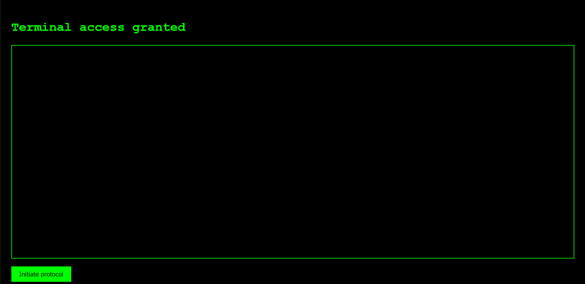
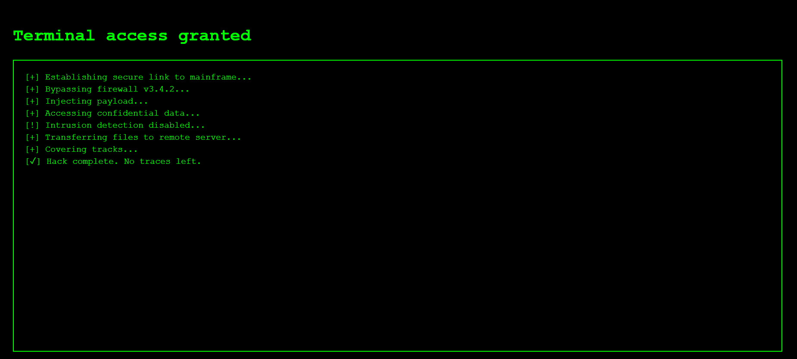

# secure-ci-cd-node-app
This project is a simple Node.js web application designed to simulate a secure software deployment pipeline

## features
- Express.js server setup
- Helmet for basic security headers
- Dockerized deployment using Render
- `.env` support via `dotenv`
- Simulated fake "hacking" console for educational/demo purposes

## screenshots

## setup

1. clone the repo using the following commands
   - git clone https://github.com/yasmine-touati/secure-ci-cd-node-app
   - cd secure-ci-cd-node-app
   
2. install dependencies using
   - npm install

3. create an .env file containing
   - SECRET=place-your-secret-message-here
   - PORT=3000
  
4. run locally using the command
   - node index.js

5. visit the following on your browser
   - http://localhost:3000

## docker
  - build the app using
       - docker build -t secure-ci-cd-node-app .
  - run the app using
      - docker run -p 3000:3000 --env-file .env secure-ci-cd-node-app

## security features
  - helmet middleware for setting secure http headers
  - .env file for secret values (this file shouldn't be commited)
  - dockerization for isolated deployment

## live demo
this app was deployed using Render

## future improvements
  - unit testing
  - gitHub ations for automated testing
  - input validation

## author
Yasmine Touati

## licence
this project is licensed under the MIT License
